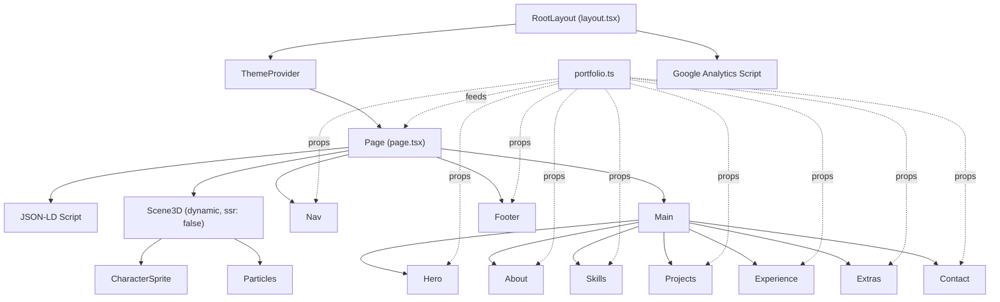
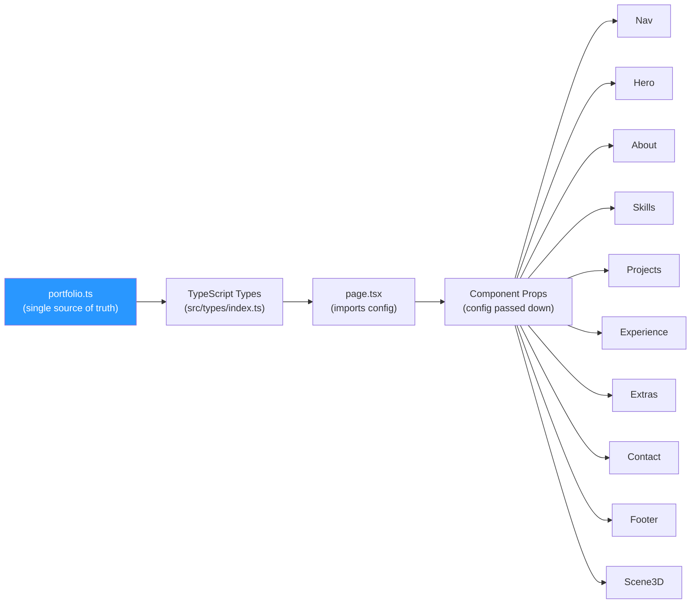
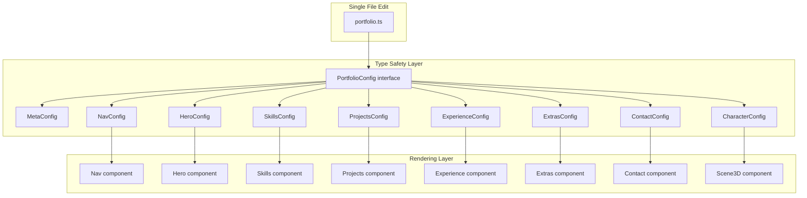
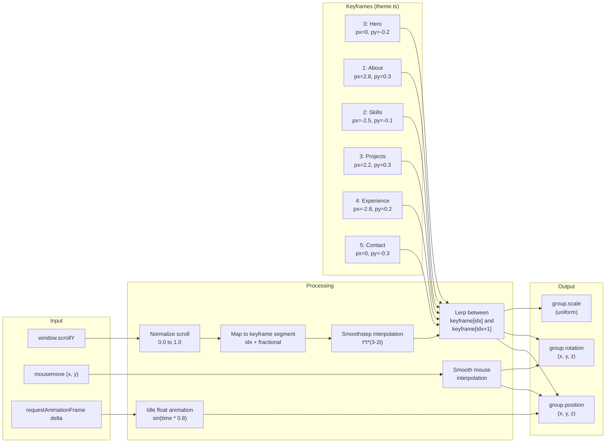
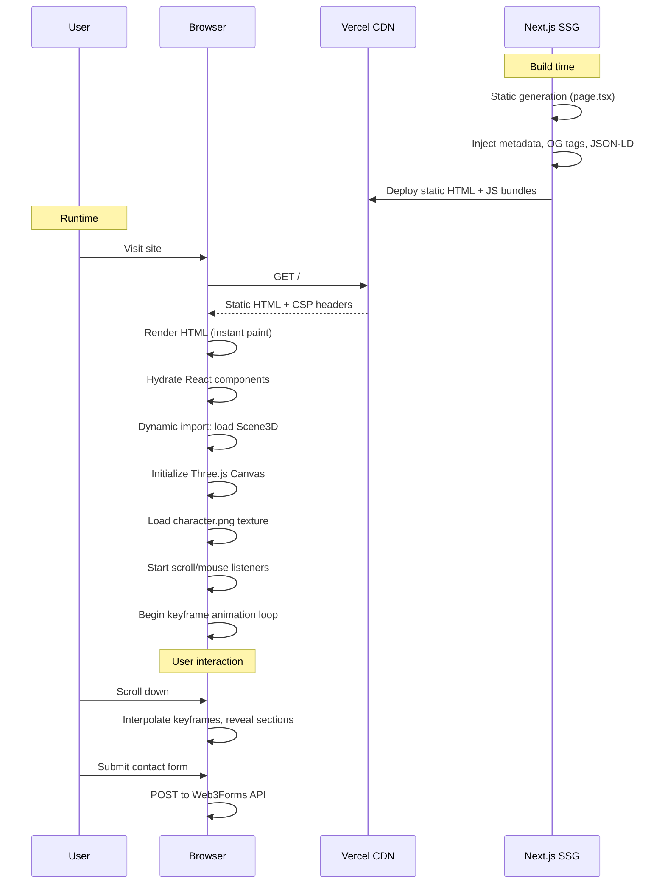

# Sai Sarthak Mohapatra -- Portfolio

**A config-driven, Apple-inspired developer portfolio with an interactive 3D scene, dark/light mode, and scroll-driven animations.**

[](https://nextjs.org/)
[](https://www.typescriptlang.org/)
[](https://tailwindcss.com/)
[](https://threejs.org/)
[](https://vercel.com/)

---

## Live Demo

> **[https://saisarthakmohapatra.site](https://saisarthakmohapatra.site)**

---

## Demo


---

## Features

### Core

- **Config-driven architecture** -- all content lives in a single `portfolio.ts` file. Zero component code changes needed to update content.
- **Responsive design** -- mobile-first layout with breakpoints for tablet and desktop.
- **Dark / Light mode** -- system-aware theme toggle using `next-themes`, with Apple-inspired design tokens in CSS custom properties.
- **Interactive 3D scene** -- a character sprite and floating particles rendered via Three.js (`@react-three/fiber`), reacting to scroll position and mouse movement.
- **Scroll-triggered animations** -- `IntersectionObserver`-powered reveal effects (`reveal-fade`, `reveal-scale`) across all sections.
- **Glassmorphism navigation** -- frosted-glass navbar with automatic color inversion over dark sections.

### SEO and Performance

- **Open Graph and Twitter Card meta tags** -- generated from config in `layout.tsx`.
- **JSON-LD structured data** -- `Person` schema injected on the page for rich search results.
- **Robots meta** -- full crawl/index directives with googleBot-specific settings.
- **Content Security Policy** -- strict CSP headers in `next.config.mjs` covering scripts, styles, fonts, images, and connections.
- **Google Analytics** -- loaded via `afterInteractive` strategy to avoid blocking page render.
- **Static generation** -- Next.js App Router with no dynamic server rendering; fully static export.
- **Dynamic imports** -- Three.js scene loaded client-only (`ssr: false`) to reduce initial bundle.
- **Font optimization** -- Inter font with `display: swap` via `next/font/google`.

### Sections

| Section | Description |
|---------|-------------|
| **Hero** | Full-viewport sticky section with parallax fade-out, headline, subhead, and CTAs. Scroll hint at the bottom. |
| **About** | Word-by-word text reveal on scroll. |
| **Skills** | Auto-fill grid of 60+ technology icons via `tech-stack-icons`, with light/dark variants. |
| **Projects** | Card grid with featured (2-col span) support, tag pills, gradient accents, and GitHub links. |
| **Experience** | Timeline-style list with role, company, period, location, description, and bullet highlights. Dark background section. |
| **Extras** | Tabbed interface (ARIA-compliant) with five panels: Certifications, Education, Soft Skills, Languages, Interests. |
| **Contact** | Email compose form (macOS mail-style UI) powered by Web3Forms API with mailto fallback. Social links and resume download. |
| **Footer** | Navigation links and copyright. |

### Accessibility

- Semantic HTML (`section`, `nav`, `main`, `h1`-`h3`, `ul`/`li`).
- `aria-labelledby` on every section linking to heading IDs.
- ARIA `role="tablist"`, `role="tab"`, `aria-selected`, `aria-controls`, and `role="tabpanel"` on the Extras tabs.
- `aria-label` and `aria-expanded` on the mobile menu toggle and theme toggle.
- Keyboard-navigable links and buttons.
- Screen-reader-friendly hidden scroll hint.

---

## Architecture

### Component Tree



### Config Flow



---

## Tech Stack

| Technology | Purpose | Version |
|------------|---------|---------|
| [Next.js](https://nextjs.org/) | React framework, App Router, SSG, metadata API | ^14.2.0 |
| [React](https://react.dev/) | UI library | ^18.3.0 |
| [TypeScript](https://www.typescriptlang.org/) | Type safety across config, types, and components | ^5.4.0 |
| [Tailwind CSS](https://tailwindcss.com/) | Utility-first styling with custom design tokens | ^3.4.0 |
| [Three.js](https://threejs.org/) | 3D rendering engine | ^0.162.0 |
| [@react-three/fiber](https://docs.pmnd.rs/react-three-fiber) | React renderer for Three.js | ^8.16.0 |
| [next-themes](https://github.com/pacocoursey/next-themes) | Dark/light mode with system detection | ^0.3.0 |
| [tech-stack-icons](https://www.npmjs.com/package/tech-stack-icons) | SVG technology icons with dark/light variants | ^3.7.1 |
| [Web3Forms](https://web3forms.com/) | Serverless contact form submission | API |
| [Google Analytics](https://analytics.google.com/) | Site analytics (optional) | gtag.js |

---

## Project Structure

```
portfolio/
├── public/
│   └── assets/
│       ├── images/
│       │   └── character.png          # 3D scene character sprite
│       └── resume.pdf                 # Downloadable resume
├── src/
│   ├── app/
│   │   ├── globals.css                # CSS custom properties, animations, utility classes
│   │   ├── layout.tsx                 # Root layout: fonts, metadata, OG tags, GA, ThemeProvider
│   │   └── page.tsx                   # Main page: JSON-LD, component composition
│   ├── components/
│   │   ├── 3d/
│   │   │   └── Scene.tsx              # Three.js canvas, character sprite, particles
│   │   ├── layout/
│   │   │   ├── Nav.tsx                # Glassmorphism navbar, mobile menu, theme toggle
│   │   │   └── Footer.tsx             # Footer links and copyright
│   │   ├── providers/
│   │   │   └── ThemeProvider.tsx       # next-themes wrapper
│   │   └── sections/
│   │       ├── Hero.tsx               # Full-viewport hero with parallax
│   │       ├── About.tsx              # Word-by-word scroll reveal
│   │       ├── Skills.tsx             # Tech icon grid
│   │       ├── Projects.tsx           # Project card grid
│   │       ├── Experience.tsx         # Work timeline
│   │       ├── Extras.tsx             # Tabbed certifications/education/skills/languages/interests
│   │       └── Contact.tsx            # Email form + social links
│   ├── config/
│   │   ├── portfolio.ts               # ALL site content — single source of truth
│   │   ├── theme.ts                   # Design tokens + 3D scene keyframes
│   │   └── icons.ts                   # SVG icon strings for contact links
│   └── types/
│       └── index.ts                   # TypeScript interfaces for entire config
├── .env.local                         # Environment variables (secrets, API keys)
├── next.config.mjs                    # CSP headers, webpack config, transpile packages
├── tailwind.config.ts                 # Custom colors, spacing, fonts referencing CSS vars
├── tsconfig.json                      # TypeScript configuration
└── package.json                       # Dependencies and scripts
```

---

## Config-Driven Architecture

The entire site content is driven by a single configuration file. To change any text, link, skill, project, or experience entry, you only edit `src/config/portfolio.ts`. Components never contain hardcoded content.



### How it works

1. `portfolio.ts` exports a `PortfolioConfig` object containing every section's data.
2. `page.tsx` imports the config and passes the relevant slice to each component as props.
3. Each component receives a strongly-typed config prop and renders it -- no content is embedded in JSX.
4. The `CharacterConfig` type supports three modes: `image` (2D sprite), `glb` (3D model), or `none`.

---

## 3D Scene Architecture

The 3D scene uses scroll position to interpolate between six keyframes, creating a smooth parallax effect as the user scrolls through sections.



Each keyframe defines: `px`, `py`, `pz` (position), `rx`, `ry`, `rz` (rotation), `scale`, and `lid` (legacy field). The character sprite alternates between left and right screen positions as the user scrolls through sections, creating a natural visual rhythm.

Responsive scaling applies a multiplier based on viewport width: mobile (0.35), tablet (0.4--0.8), desktop (1.0).

---

## Request / Response Flow



---

## Getting Started

### Prerequisites

- **Node.js** >= 18.x
- **npm**, **pnpm**, or **yarn**

### Installation

```bash
git clone https://github.com/Sarthak88-cypher/portfolio.git
cd portfolio
npm install
```

### Environment Setup

Create a `.env.local` file in the project root:

```env
# Web3Forms -- free email delivery for contact form
# Get your key at: https://web3forms.com
NEXT_PUBLIC_WEB3FORMS_KEY=YOUR_WEB3FORMS_KEY_HERE

# Google Analytics (optional)
NEXT_PUBLIC_GA_ID=YOUR_GA_ID_HERE

# Site URL (used for OG meta tags)
NEXT_PUBLIC_SITE_URL=https://yoursite.com

# Social links
NEXT_PUBLIC_LINKEDIN_URL=https://www.linkedin.com/in/YOUR_PROFILE
NEXT_PUBLIC_GITHUB_URL=https://github.com/YOUR_USERNAME

# Personal email
NEXT_PUBLIC_EMAIL_ID=your@email.com

# AWS Certification link (optional)
NEXT_PUBLIC_AWS_CERT_URL=https://www.credly.com/badges/YOUR_BADGE_ID/public_url
```

### Run Development Server

```bash
npm run dev
```

Open [http://localhost:3000](http://localhost:3000).

### Build for Production

```bash
npm run build
npm start
```

---

## Customization Guide

### Change Content

Edit `src/config/portfolio.ts`. Every section -- hero headline, about text, skills, projects, experience, extras, contact info -- is defined there. No component code changes needed.

```typescript
// Example: change the hero headline
hero: {
  overline: 'Your tagline here',
  headline: 'Your Name.',
  subhead: 'Your description here.',
  ctas: [
    { label: 'See my work', href: '#projects' },
    { label: 'Get in touch', href: '#contact' },
  ],
},
```

### Change Theme and Colors

Edit the CSS custom properties in `src/app/globals.css`. The `:root` block controls dark mode defaults; the `.light` block controls light mode.

```css
:root {
  --accent: #2997ff;        /* Change accent color */
  --surface-primary: #0a0a0a; /* Change background */
  --content-primary: #f5f5f7; /* Change text color */
}
```

The Tailwind config in `tailwind.config.ts` references these CSS variables, so changes propagate everywhere automatically.

### Change the 3D Character

1. Replace `public/assets/images/character.png` with your own transparent PNG.
2. Adjust dimensions in `portfolio.ts`:

```typescript
character: {
  type: 'image',
  src: '/assets/images/character.png',
  width: 5,   // adjust to your image aspect ratio
  height: 3,
},
```

3. The config also supports `type: 'glb'` for 3D models or `type: 'none'` to disable the character entirely.

### Add or Remove Sections

1. Create or remove a component in `src/components/sections/`.
2. Import/remove it in `src/app/page.tsx`.
3. Add/remove the corresponding config block in `portfolio.ts` and type in `src/types/index.ts`.
4. Update nav links in `portfolio.ts` under the `nav.links` array.

### Add New Skills

Append to the `skills.items` array in `portfolio.ts`. The `icon` value must match a name from the [tech-stack-icons](https://www.npmjs.com/package/tech-stack-icons) package.

```typescript
{ name: 'Rust', icon: 'rust' },
```

---

## Deployment

### Vercel (Recommended)

1. Push your repository to GitHub.
2. Import the project on [vercel.com](https://vercel.com/).
3. Add your environment variables in the Vercel dashboard under **Settings > Environment Variables**.
4. Deploy. Vercel auto-detects Next.js and applies optimal settings.

### Other Platforms

Any platform that supports Next.js works (Netlify, AWS Amplify, Docker, etc.). Ensure:

- Node.js >= 18.x is available.
- Environment variables are configured.
- The `next build` output is served correctly.

For a fully static export, you can add `output: 'export'` to `next.config.mjs` if your host does not support Node.js.

---

## Security

| Measure | Implementation |
|---------|----------------|
| **Content Security Policy** | Strict CSP headers in `next.config.mjs` restricting scripts, styles, fonts, images, and connections to whitelisted origins. |
| **X-Frame-Options** | Set to `DENY` -- prevents embedding in iframes. |
| **X-Content-Type-Options** | Set to `nosniff` -- prevents MIME type sniffing. |
| **X-XSS-Protection** | Enabled with `mode=block`. |
| **Referrer-Policy** | `strict-origin-when-cross-origin`. |
| **Permissions-Policy** | Camera, microphone, and geolocation disabled. |
| **No external images** | `img-src` restricted to `'self' data: blob:`. |
| **Environment-based secrets** | API keys stored in `.env.local`, never committed to source control. |
| **`.gitignore` protections** | `.env.local` and `node_modules` excluded from version control. |

---

## Performance

| Optimization | Details |
|-------------|---------|
| **Dynamic imports** | Three.js scene loaded via `next/dynamic` with `ssr: false` -- excluded from server bundle and initial HTML. |
| **Font `display: swap`** | Inter font loaded with swap strategy via `next/font/google`, preventing invisible text during load. |
| **`afterInteractive` GA** | Google Analytics scripts load after hydration, not blocking first paint. |
| **Static generation** | All pages statically generated at build time -- zero server-side rendering at request time. |
| **DPR capping** | Three.js canvas capped at `dpr: [1, 2]` to balance visual quality and GPU performance. |
| **ACES Filmic tone mapping** | Efficient tone mapping in the 3D scene with controlled exposure. |
| **Smooth interpolation** | Scroll and mouse inputs smoothed with lerp factors (0.06 / 0.04) to prevent jank. |
| **IntersectionObserver** | Section reveals triggered only when elements enter the viewport -- no continuous scroll listeners for animations. |
| **Transpile packages** | `three` and `tech-stack-icons` transpiled via `next.config.mjs` for tree-shaking. |

---

## SEO

| Feature | Implementation |
|---------|----------------|
| **Open Graph tags** | Title, description, URL, site name, locale, and optional OG image -- generated from `portfolio.ts` config in `layout.tsx`. |
| **Twitter Cards** | `summary_large_image` card with title, description, and optional image. |
| **JSON-LD** | `Person` schema with name, URL, job title, description, social profiles, and skills injected in `page.tsx`. |
| **Robots meta** | `index: true, follow: true` with googleBot-specific directives for max video preview, image preview, and snippet length. |
| **Semantic HTML** | Proper heading hierarchy (`h1` in Hero, `h2` per section), `section` elements with `aria-labelledby`, and `main` landmark. |
| **Sitemap and robots.txt** | Can be added via Next.js `app/sitemap.ts` and `app/robots.ts` (App Router conventions). |

---

## License

This project is licensed under the [MIT License](LICENSE).

---

## Author

**Sai Sarthak Mohapatra**

- Website: [saisarthakmohapatra.site](https://saisarthakmohapatra.site)
- GitHub: [github.com/Sarthak88-cypher](https://github.com/Sarthak88-cypher)
- LinkedIn: [linkedin.com/in/saisarthakmohapatra88](https://www.linkedin.com/in/saisarthakmohapatra88)
- Email: saisarthakmohapatra@gmail.com
